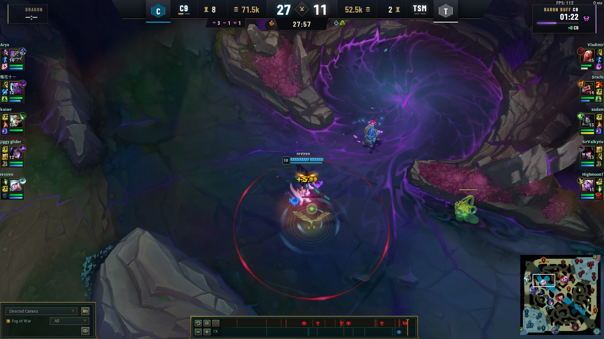

# LoL Scoreboard

**An esports-broadcast-style scoreboard overlay for casting League of Legends games in OBS** — team kills, gold, turrets, objectives, spawn timers, and series score, styled like the pro broadcasts and driven live by Riot's Live Client Data API. No Riot API key, no rate limits, no cloud: everything runs on the caster's PC.



## Features

- **Broadcast top bar** — team logos/tags, best-of series score, turrets taken, team gold, kill score, game clock, per-team objective chips (drakes, grubs, herald, baron)
- **Objective spawn timers** — dragon countdown top-left; grubs → herald → baron pit progression top-right; baron/elder buff bar with gold swing
- **Hybrid overlay mode** *(default)* — an opaque plate covers the in-game spectator HUD's numbers while the game's **own drake element icons show through** below, so drake elements are always accurate with zero input
- **Fully themeable** — four palette colors + header/body Google Fonts, editable live from the control panel
- **Between-games mode** — the bar stays up with teams and series score between games of a series ("STARTING SOON")
- **Zero-friction control panel** — native app window; every change pushes to the overlay instantly, no save button
- **Ships as a normal Windows app** — installer, Start Menu shortcuts, no runtime dependencies (Node is compiled in)

## Install (casters)

1. Grab **`LoL-Scoreboard-Setup.exe`** from the [latest release](../../releases/latest) and run it (per-user install, no admin). Windows SmartScreen will warn once — *More info → Run anyway* (unsigned installer).
2. Launch **LoL Scoreboard** from the Start Menu. The control panel opens automatically.
3. In OBS: **Sources → + → Browser**, paste `http://localhost:3000/overlay`, set **Width 1920, Height 1080**, layer it above your game capture.
4. **Keep the built-in scoreboard HUD ON** in the LoL spectator client — the overlay covers it and reuses its drake icons.
5. Set team names, tags, colors, and logos in the panel. Cast.

There's also a **Test Mode** Start Menu shortcut that runs a simulated late-game so you can set up your OBS scene without a running game.

> ⚠️ **Only tested at 1920×1080** (game client and OBS canvas). Other resolutions are unsupported.

## How it works

The app polls the local **Live Client Data API** (`https://127.0.0.1:2999/liveclientdata/allgamedata`) that the game client serves while playing or spectating — kills, scores, items, and game time come from there in real time. Team gold is estimated from CS/kills/income with an item-value floor (the API only exposes exact gold for the active player). Objective *counts* are displayed via the hybrid mode's pass-through of the game's own HUD icons, because the 2026 spectator API no longer emits neutral-monster kill events.

Overlay modes (Match Settings):

| Mode | In-game HUD | What you get |
|---|---|---|
| **Hybrid** (default) | ON | Plate hides Riot's numbers; Riot's drake icons show through |
| Cover | ON | Full plate hides the entire HUD region |
| Transparent | OFF | Floating bar only |

## Building from source

Requirements: Windows, Node 18+, [Inno Setup 6](https://jrsoftware.org/isinfo.php) (`winget install -e --id JRSoftware.InnoSetup`).

```
npm install          # dev tools (esbuild, pkg, resedit)
npm run installer    # -> dist/LoL-Scoreboard-Setup.exe
```

Dev loop without packaging:

```
node server.js --mock   # simulated game
node server.js          # live client mode
# overlay: http://localhost:3000/overlay   panel: http://localhost:3000/control
```

The build pipeline: esbuild bundles the zero-dependency Node server → `pkg` compiles a standalone exe → `resedit` stamps the icon/version and flips it to a GUI app → `csc` (bundled with Windows) compiles the native WebView2 panel window → Inno Setup packages the installer.

## Objective timing constants

First-spawn times and respawn rules live in `RULES` at the top of `lib/state.js` (dragon 5:00, grubs 8:00, herald 15:00, baron 20:00, buff durations, soul at 4 drakes). Update there when a patch moves them.

## Disclaimer

LoL Scoreboard isn't endorsed by Riot Games and doesn't reflect the views or opinions of Riot Games or anyone officially involved in producing or managing League of Legends. League of Legends and Riot Games are trademarks or registered trademarks of Riot Games, Inc. Objective icons and fonts are Riot assets obtained via [CommunityDragon](https://communitydragon.org/).
